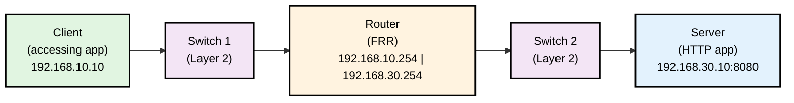

# netwiz

**netwiz** - A powerful network visualization and monitoring platform with AI-powered assistance.

 

## Overview

A self-healing network system that uses AI and Ansible to detect, roll back, and adjust network configurations.

## Stack
- Python
- FastAPI
- Ansible
- OpenSearch
- Docker
- React (UI)
- TypeScript

## Demo Infrastructure

The demo infrastructure creates a multi-tier network topology using Docker containers:

### Network Architecture

- **Management Network**: 172.25.0.0/24 (for SSH access and control)
- **Client Network**: 192.168.10.0/24 (client-side network)
- **Server Network**: 192.168.30.0/24 (server-side network)

### Containers

- **Client**: Test client (192.168.10.10)
- **Switch1**: OVS-based Layer 2 switch (SSH: port 7771)
- **Router**: FRR router with dual interfaces (SSH: port 7777)
  - Client-side: 192.168.10.254
  - Server-side: 192.168.30.254
- **Switch2**: OVS-based Layer 2 switch (SSH: port 7778)
- **Server**: HTTP server on port 8080 (192.168.30.10, SSH: port 7780)

## Services

- collective-hackathon: 192.168.0.130
- collective-ansible: 192.168.0.131
- collective-opensearch: 192.168.0.132

## Goals

- Monitor logs via OpenSearch
- Version control of configs
- Event-driven network management with AI
- End-to-end network testing and validation

## To Do

- [x] Network data structure visualization in the UI
- [x] Device configuration retrieval via Ansible playbooks
- [ ] Version control system for device configurations
  - [ ] Tagging mechanism for stable configurations
  - [ ] Configuration history tracking
- [ ] Automated rollback functionality for failed changes
  - [ ] Create network tests & validations that trigger a failure & rollback
- [ ] Design Chat + Version Control Config interfaces
- [ ] Change from LLama to more stable or better-performing model
- [ ] Full Self-Driving
  - [ ] Create Network Monitoring Strategy that relevantly triggers events
  - [ ] Root Cause Analysis from event >> Rollback or Make Changes
