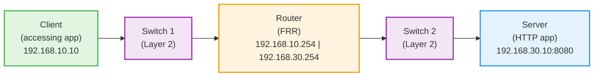

# CLAUDE.md

This file provides guidance to Claude Code (claude.ai/code) when working with code in this repository.

## Project Overview

This is a **network infrastructure demo environment** that simulates a multi-tier network topology using Docker containers. It's part of the larger "Self-Healing Network" project that uses AI and Ansible for automated network configuration management.

We want to create the following network topology:

the goal here is to create a network where the client can access the server via the router and switches.

## Testing

we need to have a e2e testing framework to test the network.